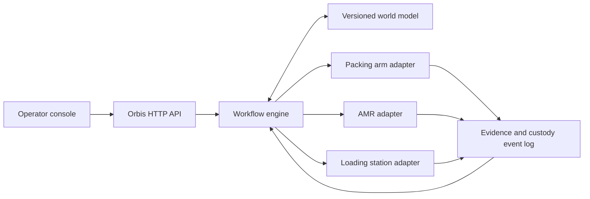

# Architecture

## Safety boundary

Orbis gives an edge agent an objective such as `move_package`. The edge agent
owns path planning, collision avoidance, motion control, local perception, and
all certified safety behavior. Orbis may stop scheduling new work, but it is not
in the emergency-stop loop.

## Reference slice

The current repository keeps all state in one process to make the protocol easy
to inspect. Interfaces are separated so the simulator agents can later be
replaced by OPC UA, ROS 2, MQTT, vendor SDK, or vehicle adapters.

## Next production boundaries

- **Workflow service:** durable task state, timers, retries, compensation, and
  idempotency.
- **Agent registry:** capability discovery, health, location, compatibility,
  certification, and availability.
- **World-model service:** versioned objects, spatial state, custody, and
  confidence-aware reconciliation.
- **Evidence service:** immutable sensor artifacts, hashes, signatures,
  retention, and audit queries.
- **Policy engine:** authorization, safety constraints, facility rules, and
  human approvals.
- **Edge gateway:** authenticated machine adapters and offline-safe operation.
- **Federation gateway:** trust and custody exchange across facilities,
  carriers, ports, and organizational boundaries.

