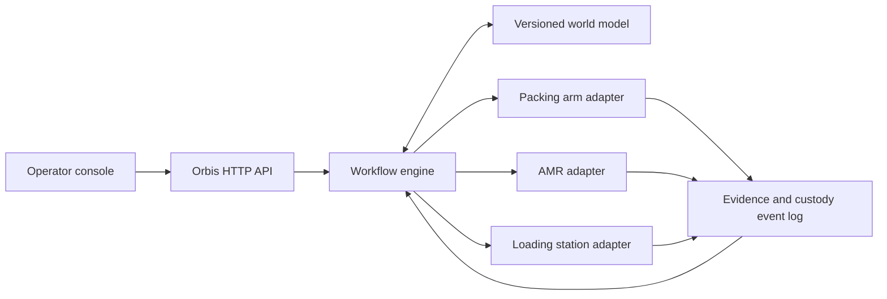

# Architecture

## Safety boundary

Orbis gives an edge agent an objective such as `move_package`. The edge agent
owns path planning, collision avoidance, motion control, local perception, and
all certified safety behavior. Orbis may stop scheduling new work, but it is not
in the emergency-stop loop.

## Reference slice

## Intelligence-layer contract

The intelligence layer compiles a natural-language objective into a plan; it
does not send actuator commands. Its output contains:

1. an explicit, verifiable end state;
2. one outcome-level task per required capability;
3. a hard capability match and rationale for every assigned robot;
4. an acyclic dependency graph;
5. execution waves whose tasks may run concurrently only when their resource
   leases do not overlap;
6. the sensor evidence required to complete each task; and
7. policy decisions marked `passed`, `gated`, or `blocked`.

A `gated` decision requires an approval or a missing constraint before its
affected task can be released. A `blocked` decision prevents the plan from
executing. A plan with no qualified robot is blocked; Orbis never widens a
capability requirement merely to keep the workflow moving.

### Delegation guardrails

- **Capability is a hard constraint.** Availability, distance, or speed may
  rank qualified robots but cannot make an unqualified robot eligible.
- **Safety stays local.** Orbis delegates an outcome and a safety envelope.
  Collision avoidance, path planning, protective stops, and emergency control
  remain inside the robot or certified cell controller.
- **Reservations precede concurrency.** Every active task holds time-bounded
  leases for its robot, physical zone, manipulated object, and any exclusive
  fixture. Conflicting tasks are moved into a later wave.
- **Dependencies release on proof.** A downstream task starts only after the
  named evidence policy passes. Elapsed time and an upstream success claim are
  not sufficient.
- **Custody is two-party.** A physical object changes custodian only when sender
  proof, object identity, recipient identity, receiving-zone safety, and the
  recipient's acceptance all agree.
- **Purchases are scoped.** Item list, spend limit, substitutions, merchant, and
  delivery address must be authorized. Missing or changed terms gate checkout.
- **Substitution never weakens policy.** A failed or offline robot may be
  replaced only by another healthy robot that satisfies the same capability,
  certification, payload, environment, and evidence constraints.
- **Uncertainty fails safe.** People, pets, spills, damaged parcels, restricted
  goods, unknown objects, stale maps, or low-confidence evidence pause the
  affected task for a person; they do not silently lower thresholds.
- **Follow-ups are recompiled.** A user update is analyzed against the current
  world model and active leases before any robot receives revised work.

The current repository keeps all state in one process to make the protocol easy
to inspect. Interfaces are separated so the simulator agents can later be
replaced by OPC UA, ROS 2, MQTT, vendor SDK, or vehicle adapters.

## Next production boundaries

- **Workflow service:** durable task state, timers, retries, compensation, and
  idempotency.
- **Agent registry:** capability discovery, health, location, compatibility,
  certification, and availability.
- **World-model service:** versioned objects, spatial state, custody, and
  confidence-aware reconciliation.
- **Evidence service:** immutable sensor artifacts, hashes, signatures,
  retention, and audit queries.
- **Policy engine:** authorization, safety constraints, facility rules, and
  human approvals.
- **Edge gateway:** authenticated machine adapters and offline-safe operation.
- **Federation gateway:** trust and custody exchange across facilities,
  carriers, ports, and organizational boundaries.
